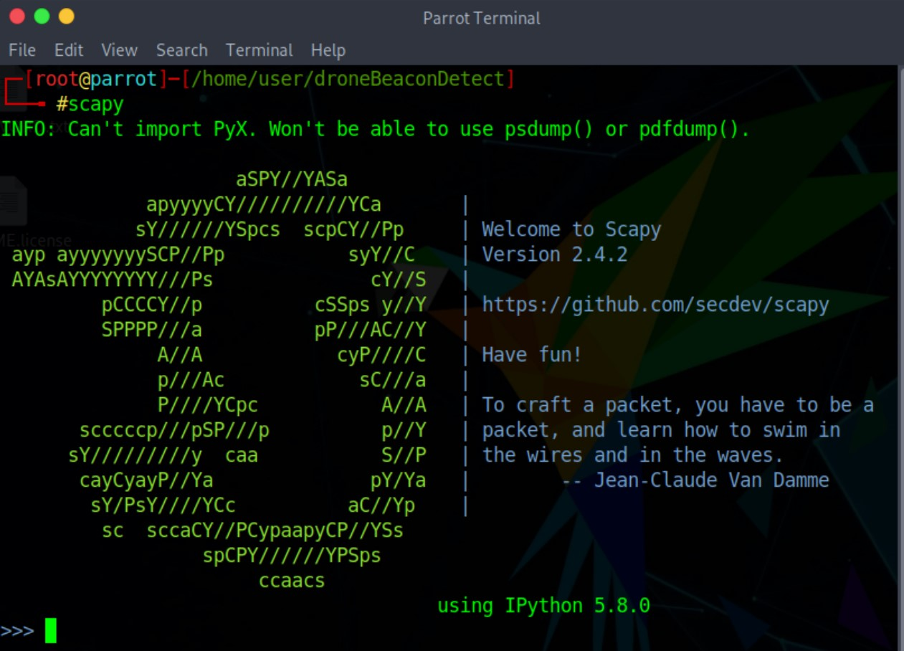
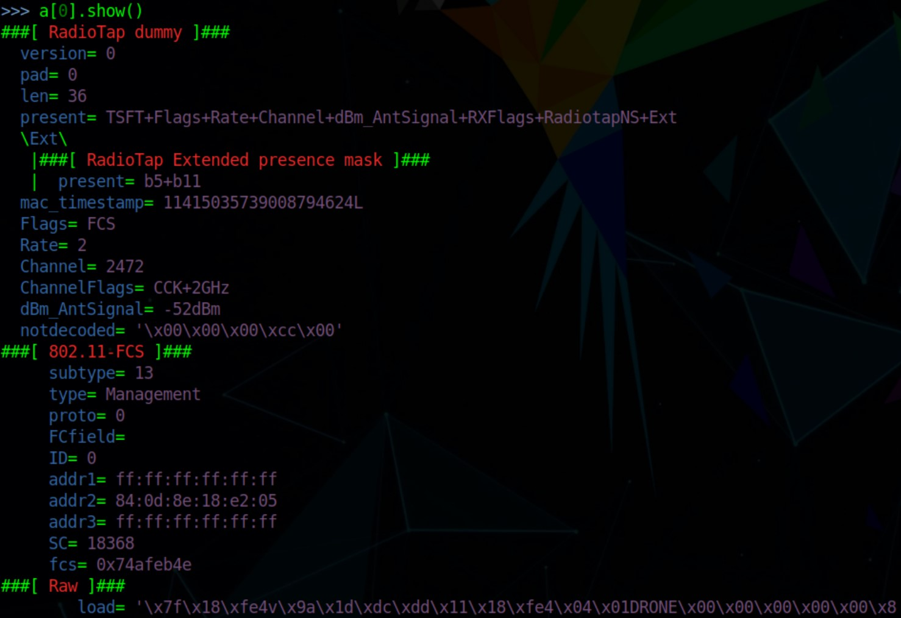

# ESP-Now Action Frame Manipulation

Python ESP-Now packet manipulation for communication between linux devices and ESP32 using scapy. [Scapy] is a Python interpreter that enables you to create, forge, or decode packets on the network, to capture packets and analyze them, to dissect the packets, etc. It also allows you to inject packets into the network. It supports a wide number of network protocols and it can handle and manipulate wireless communication packets.

### Prerequisites

Hardware required :
1. Wireless adapter which can go into monitor mode, a simple google about your laptop's wireless chipset can do. Or you can get an external [dongle which supports monitor mode]. I am using a wireless dongle with Atheros AR9271 chipset.

Software required :
1. Scapy
```
pip install scapy
```

Make sure that your WiFi card has entered monitor mode. It is possible to do this with some googling, I am going to show how to do that in Linux:
```
ifconfig <interface> down

iwconfig <interface> mode monitor

ifconfig <interface> up
```
or if you have installed aircrack suite:
```
airmon-ng start <interface>
```

### Launching Scapy

In Linux, make sure you are root before running scapy. Below is the interface you will be greeted with.



### Commands/Methods

To look at all the commands, type
```
lsc()
```
However, the only few commands/methods you will need is
```
1. rdpcap(<pcap_filename>)
2. wrpcap(<pcap_filename>,packet)
3. show()
```
### Pcap Manipulation

To manipulate the data, first we have to understand the data available in the frame. So we will read the pcap and store it in a variable. After storing it, we can look at the content using the show() method.
```
pkt = rdpcap('espnow.pcap')
pkt[0].show()
```



Note that, to change any field in the packet, for example mac address and data:
```
pkt[0].addr2= aa:bb:cc:11:22:33
pkt[0].load= '\hello world'
```
### Saving the pcap file

To save the manipulated packet to be sent later, just write
```
wrpcap('espnow.pcap', pkt[0])
```

### Sending forged packet

```
sendp(pkt[0])
```


## Contributing

Please contact me @ brandonting@hotmail.com if you feel like contributing or ask about any question.

## Versioning

## License

This project is licensed under the MIT License - see the [LICENSE.md](LICENSE.md) file for details

[Beacon frames]: https://en.wikipedia.org/wiki/Beacon_frame
[Scapy]: https://resources.infosecinstitute.com/what-is-scapy/#gref
[dongle which supports monitor mode]: https://www.wirelesshack.org/best-kali-linux-compatible-usb-adapter-dongles.html

